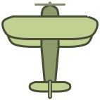

# MAD Flight!

Fly planes and earn money for insane speeds.

Test of Angular.js mouse directives.

### Features:
- Buy aircrafts and board them in the hangar
- Move the mouse (or your finger) across the screen to gain speed
- Earn money for high speed
- Touch support and mobile controls

### Avaiable planes:

| Name         | Coin multiplier | Inertness | Track interval | Track lifetime | Price |
| ------------ | --------------- | --------- | -------------- | -------------- | ----- |
| crop-duster  | x1              | 10        | 200 px         | 2000 ms        | $10   |
| senior-limon | x2              | 12        | 50 px          | 500 ms         | $250  |
| hawk         | x5              | 8         | 0 px           | 1000 ms        | $750  |
